# DevOps Project — End-to-End CI/CD & Observability on AWS EKS

---

## 🛠️ Tech Stack

| Layer | Technology |
|-------|-----------|
| Cloud | AWS (EKS, EBS, VPC) |
| IaC | Terraform |
| CI/CD | GitLab CI/CD |
| Containers | Docker, Docker Hub |
| Orchestration | Kubernetes (EKS 1.33) |
| Ingress | NGINX Ingress Controller |
| TLS | cert-manager + Let's Encrypt |
| Storage | AWS EBS CSI Driver |
| Metrics | Prometheus + kube-prometheus-stack |
| Dashboards | Grafana |
| Logs | Loki + Promtail |
| Alerting | Alertmanager |
| DB Monitoring | MySQL Exporter |
| Security Scanning | Gitleaks, Trivy |
| Code Quality | SonarQube |

---

## 🚀 CI/CD Pipeline

### GitLab Pipeline — All Stages Green

> 📸 _Screenshot: GitLab CI/CD pipeline showing all stages passing_

### Sonarqube

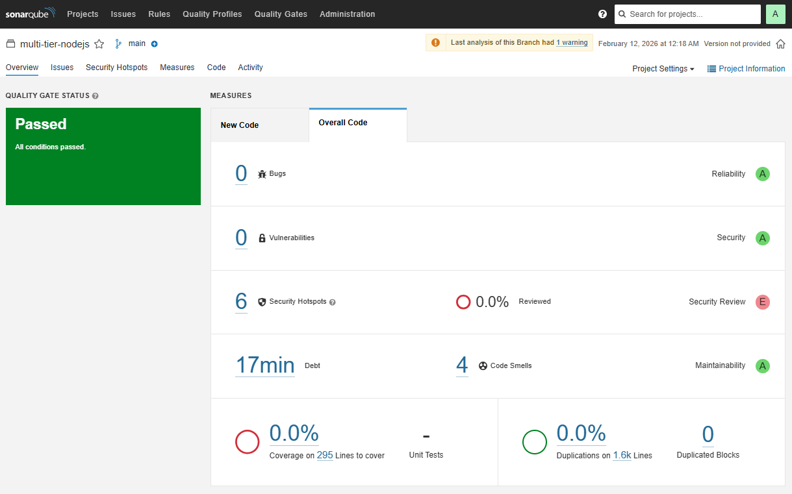
---

## ☸️ Kubernetes

### All Pods Running

> 📸 _Screenshot: `kubectl get all -n prod` :

> 📸 _Screenshot: `kubectl get pods -n monitoring` — full observability stack_

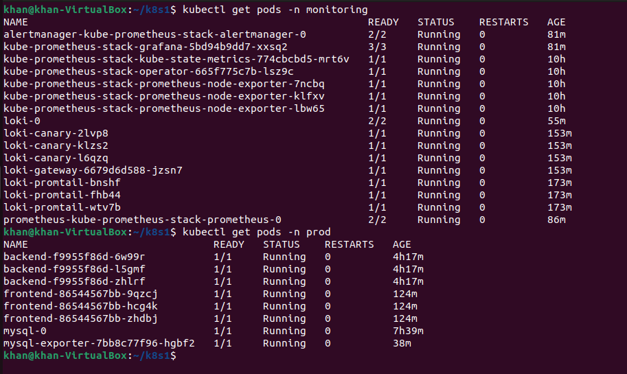

### Ingress & TLS Certificates 

> 📸 _Screenshot: `kubectl get ingress -n prod` & `kubectl get certificate -n prod` showing certificate issued_

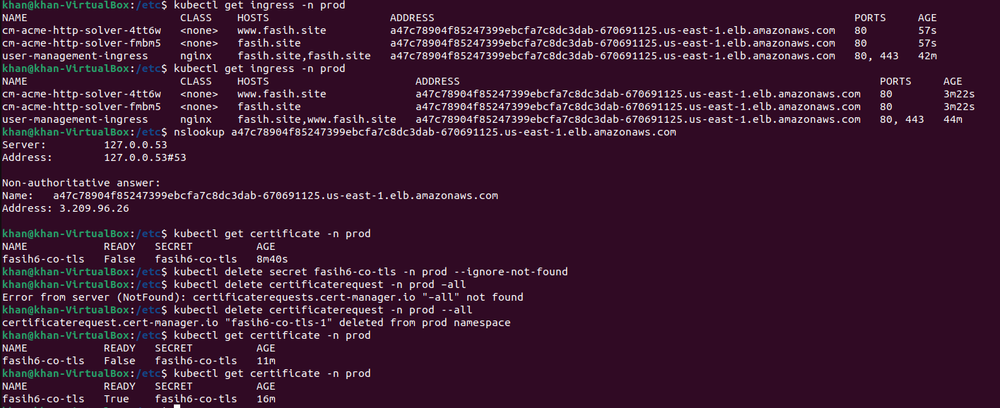

### Live Application

> 📸 _Screenshot: https://fasih.site showing the running application with TLS padlock_

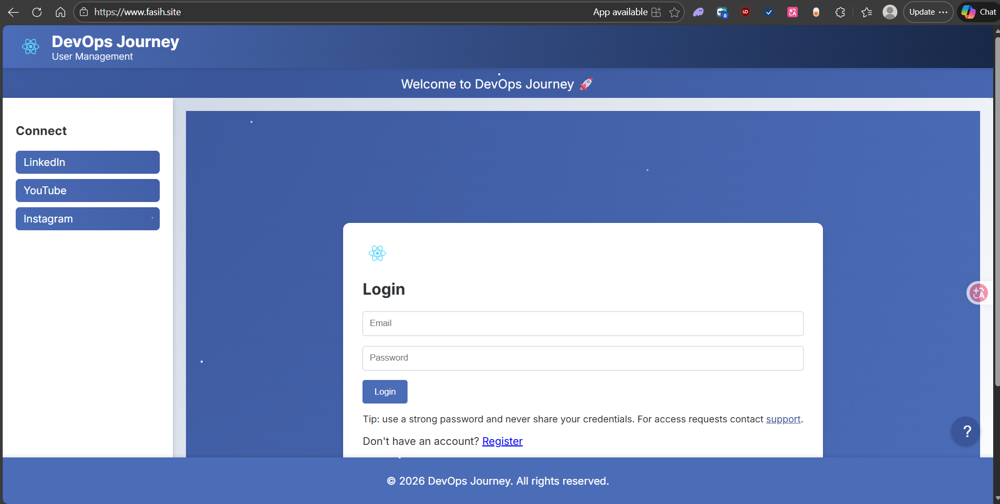

---

## 📊 Observability

The observability stack implements the **three pillars**: Metrics, Logs, and Alerting.

### Prometheus Targets

All scrape targets confirmed UP — backend pods (×3) and MySQL exporter.

> 📸 _Screenshot: Prometheus targets page showing all targets UP_

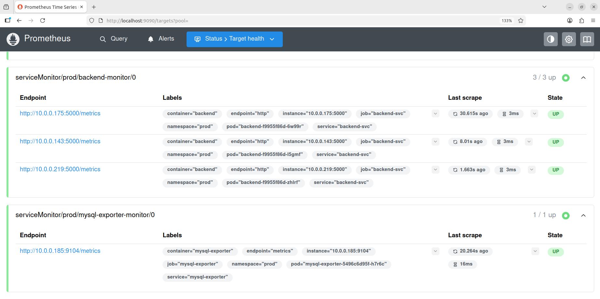

---

### Grafana Dashboards

#### Kubernetes / Compute Resources / Cluster

Cluster-wide CPU and memory usage across all nodes.

> 📸 _Screenshot: Kubernetes / Compute Resources / Cluster dashboard_

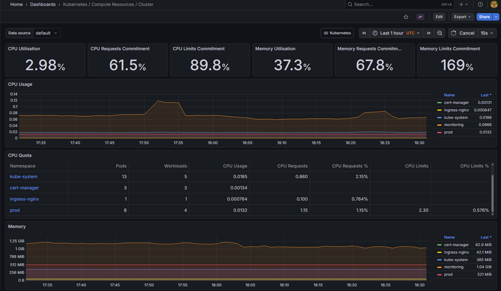

---

#### Kubernetes / Compute Resources / Namespace (Pods) — `prod`

Per-pod CPU and memory usage for backend, frontend, and MySQL pods.

> 📸 _Screenshot: Kubernetes / Compute Resources / Namespace (Pods) filtered to prod_

_prod.png)

---

#### Kubernetes / Compute Resources / Namespace (Workloads) — `prod`

Deployment and StatefulSet resource breakdown for the prod namespace.

> 📸 _Screenshot: Kubernetes / Compute Resources / Namespace (Workloads) filtered to prod_

_prod.png)

---

#### Kubernetes / Networking / Cluster

Live network traffic across the cluster.

> 📸 _Screenshot: Kubernetes / Networking / Cluster dashboard_

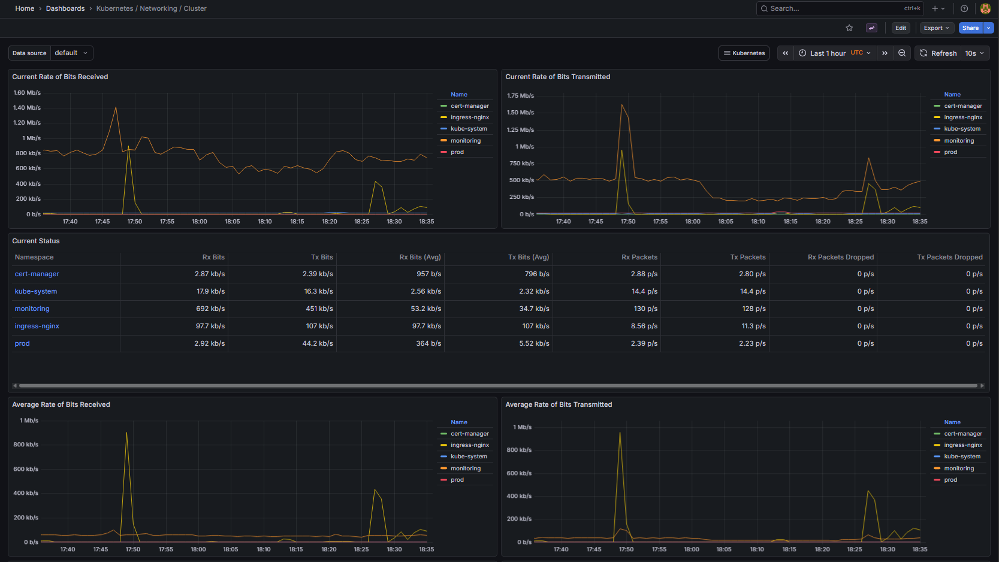

---

#### Alertmanager / Overview

Alerting pipeline status and alert routing overview.

> 📸 _Screenshot: Alertmanager / Overview dashboard_

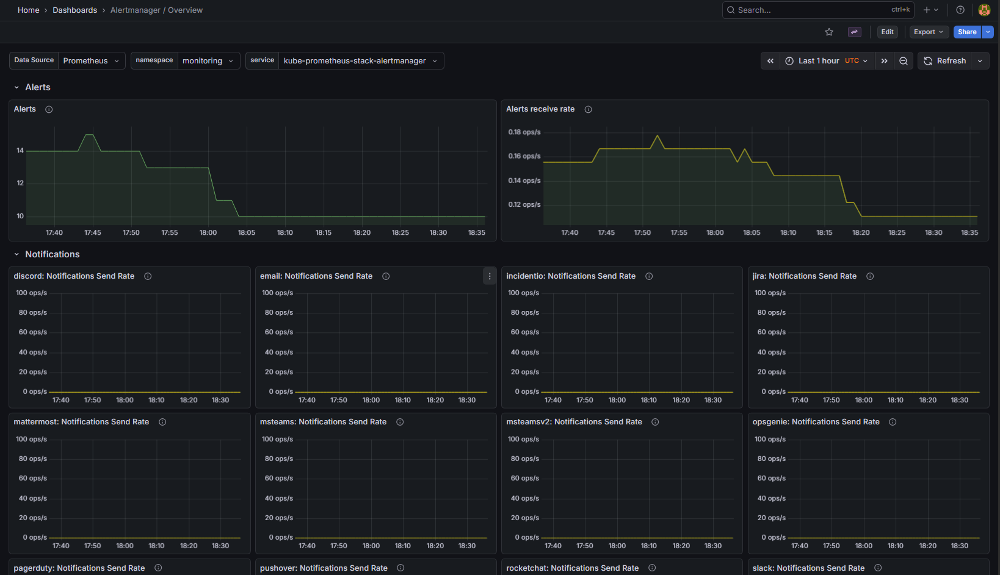

---

#### Kubernetes / Kubelet

Node-level health and kubelet metrics.

> 📸 _Screenshot: Kubernetes / Kubelet dashboard_

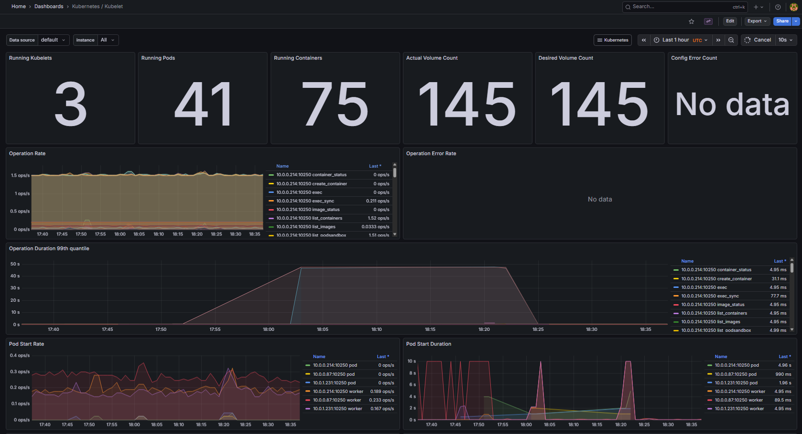

---

#### CoreDNS

DNS query rates and latency across the cluster.

> 📸 _Screenshot: CoreDNS dashboard_

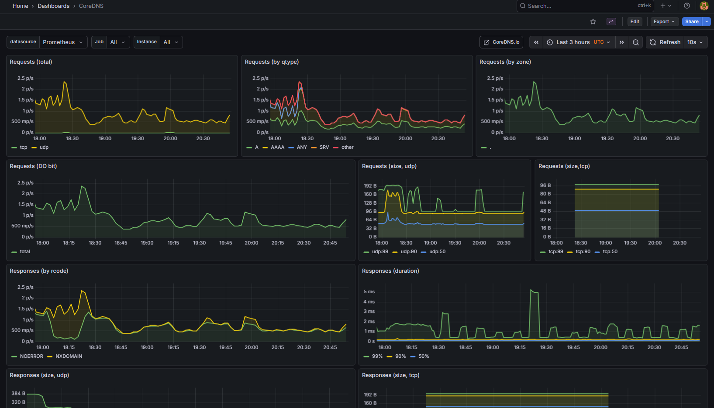

---

### Alert Rules

#### Alert Rules Overview

246 rules configured — 3 firing (Watchdog + 2 EKS-managed components), all application rules normal.

> 📸 _Screenshot: Grafana Alerting → Alert Rules page showing firing/normal counts_

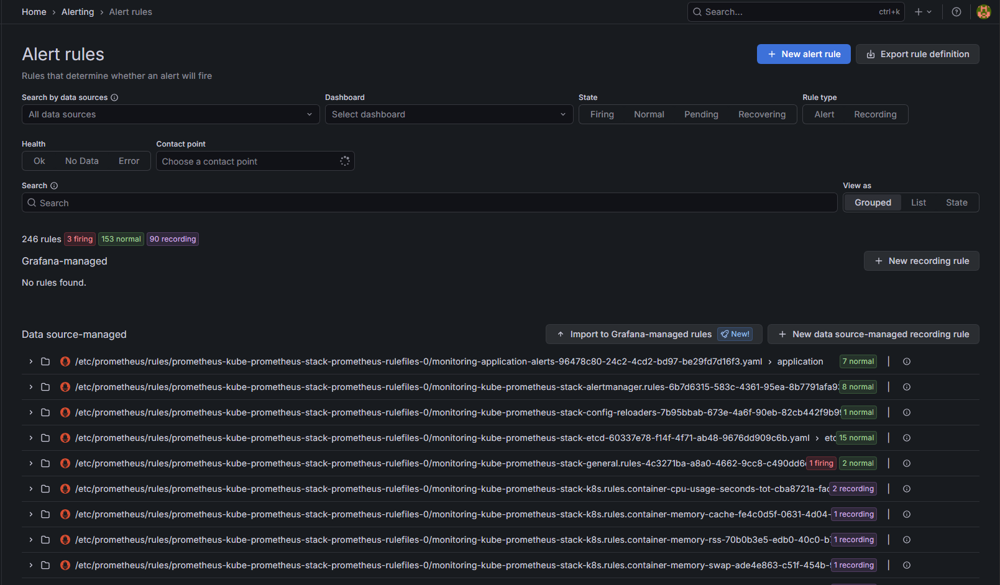

---

#### Custom Application Alert Rules

7 custom rules monitoring the prod namespace application stack — all normal.

> 📸 _Screenshot: application group expanded showing all 7 custom rules_

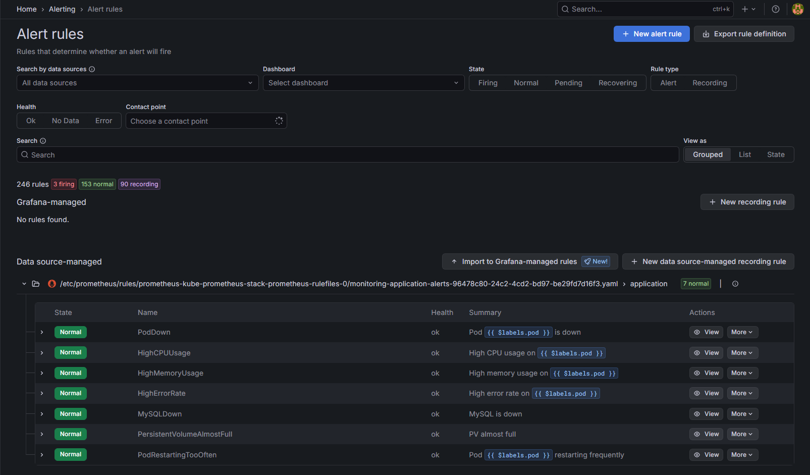

| Rule | Condition | Severity |
|------|-----------|----------|
| PodDown | Pod not Running for > 5m | Critical |
| HighCPUUsage | CPU > 80% for > 5m | Warning |
| HighMemoryUsage | Memory > 80% for > 5m | Warning |
| HighErrorRate | HTTP 5xx rate > 5% for > 5m | Critical |
| MySQLDown | mysql_up == 0 for > 1m | Critical |
| PersistentVolumeAlmostFull | PV usage > 80% for > 5m | Warning |
| PodRestartingTooOften | Restart rate > 0 for > 5m | Warning |

---

### Loki Log Aggregation

#### All prod Namespace Logs

Query: `{namespace="prod"}`

> 📸 _Screenshot: Loki Explore showing all prod pod logs streaming_

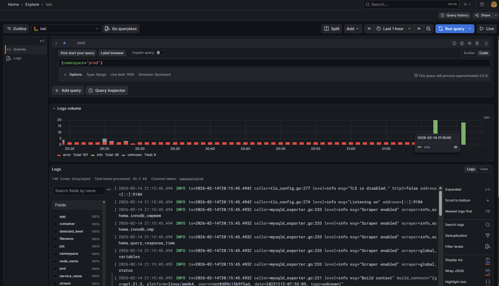

---

#### Backend Logs Only

Query: `{namespace="prod", app="backend"}`

> 📸 _Screenshot: Loki Explore filtered to backend pod logs_

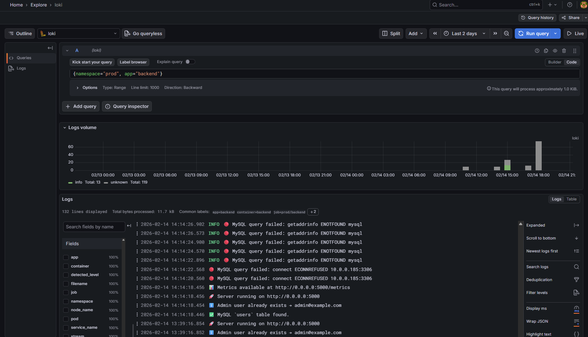

---

#### Error Filtering Across All Pods

Query: `{namespace="prod"} |= "error"`

Cross-pod error detection in a single query — real operational capability.

> 📸 _Screenshot: Loki Explore showing error-filtered logs across all prod pods_

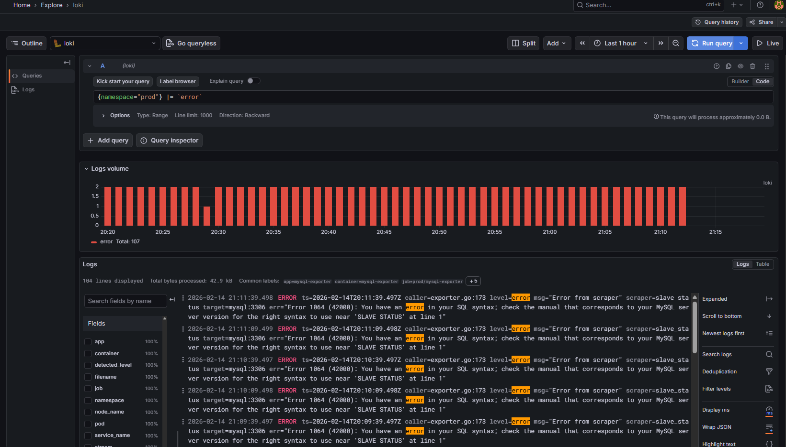

---

#### DNS settings

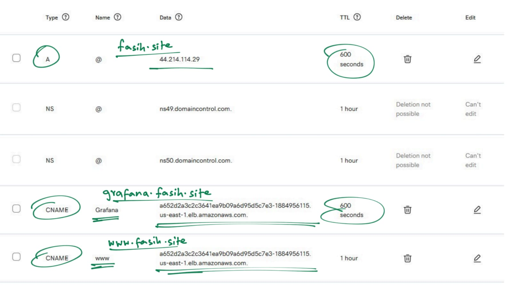
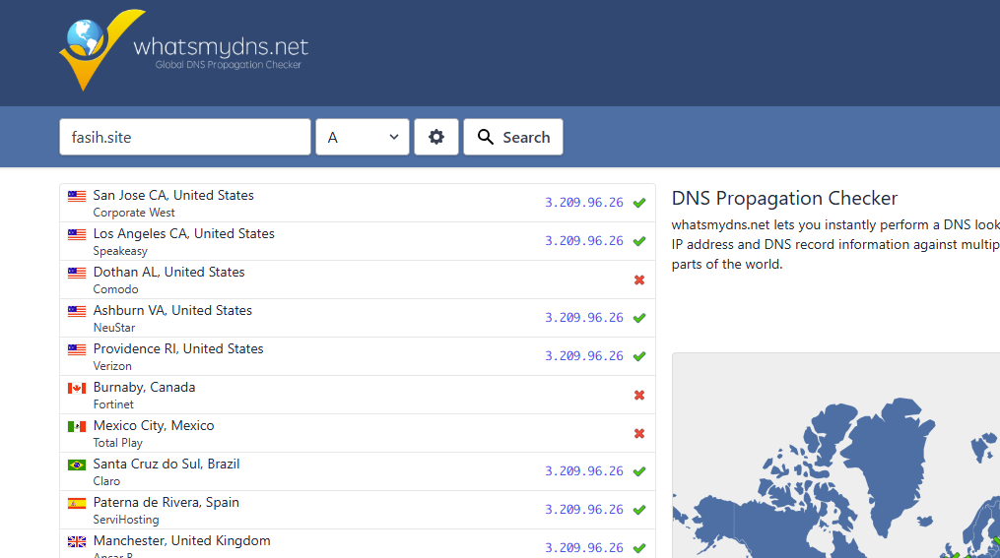
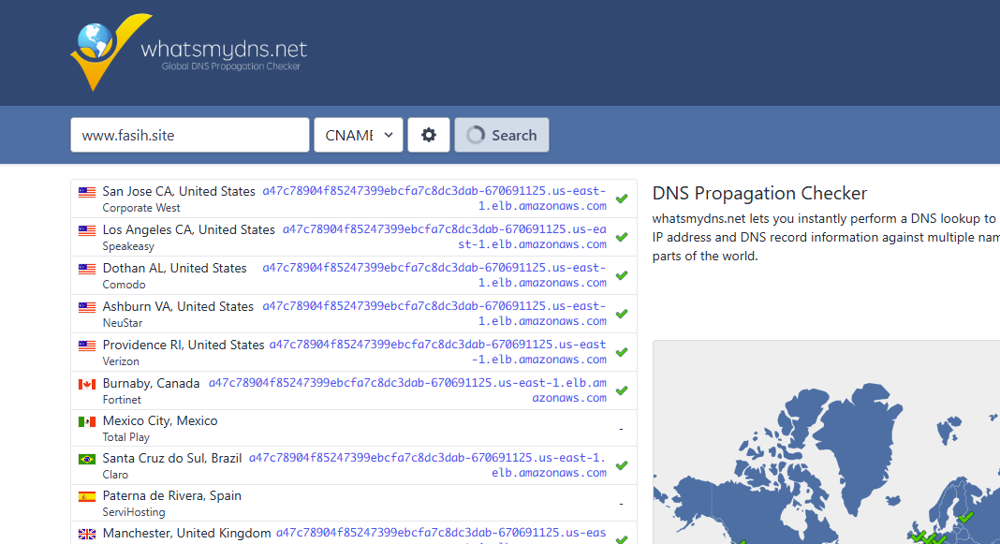
---
